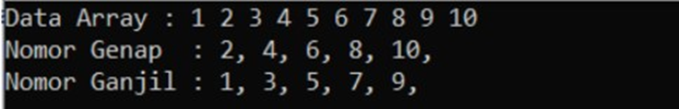

# <h1 align="center">Laporan Praktikum Modul 2 Array</h1>
<p align="center">Muhammad Ragiel Prastyo</p>

## Dasar Teori
Array merupakan struktur data yang paling dasar. Array adalah kumpulan data dengan tipe yang sama yang disimpan secara berurutan di dalam memori komputer. Berikut ini adalah beberapa jenis array :

### 1. Array Satu Dimensi
Array satu dimensi adalah tipe variabel yang terdiri dari kumpulan data dengan tipe yang sama yang disusun dalam satu baris atau satu dimensi.  Setiap elemen di dalam array memiliki sebuah indeks atau nomor yang digunakan untuk mengakses elemen tersebut. Indeks dimulai dari 0 dan berakhir pada jumlah elemen dikurangi satu.

### 2. Array Dua Dimensi
Array dua dimensi adalah variable yang terdiri dari kumpulan array satu dimensi dengan tipe yang sama yang disusun dalam baris dan kolom. Dalam array dua dimensi, setiap elemen memiliki dua indeks, yaitu indeks baris dan indeks kolom. Indeks baris menunjukkan posisi elemen dalam baris,sementara indeks kolom menunjukkan posisi elemen dalam kolom.

### 3. Array Multidimensi
Array multidimensi memiliki kesamaan dengan array satu dimensi dan dua dimensi, namun memiliki kapasitas memori yang lebih besar. Array ini digunakan untuk merepresentasikan array dengan dimensi lebih dari dua atau array yang memiliki lebih dari dua indeks, seperti array tiga dimensi, array empat dimensi, array lima dimensi, dan seterusnya.

## Guided

### 1. Program Input Array TIga Dimensi

```C++
#include <iostream>
using namespace std;
// Program untuk Input Array 3 Dimensi
int main() {
    // Deklarasi array 3 dimensi 
    int arr[2][3][3];

    // Input elemen 
    for (int x = 0; x < 2; x++) {
        for (int y = 0; y < 3; y++) {
            for (int z = 0; z < 3; z++) {
                cout << "Input Array[" << x << "][" << y << "][" << z << "] = ";
                cin >> arr[x][y][z];
            } 
        }
        cout << endl;
    }

    // Output Array 
    for (int x = 0; x < 2; x++) {
        for (int y = 0; y < 3; y++) {
            for (int z = 0; z < 3; z++) {
                cout << "Data Array[" << x << "][" << y << "][" << z << "] = " << arr[x][y][z] << endl;
            }
        }
    }
    cout << endl;
    // Tampilan array 
    for (int x = 0; x < 2; x++) {
        for (int y = 0; y < 3; y++) {
            for (int z = 0; z < 3; z++) {
                cout << arr[x][y][z] << ends; 
            }
            cout << endl; 
        }
        cout << endl; 
    }
    return 0;
}
```
Program ini memungkinkan pengguna untuk memasukkan array 3 dimensi dan kemudian menampilkan isinya dengan cara yang diformat dengan nilai elemen dan indeks yang sesuai.

### 2. Program Mencari Nilai Maksimal pada Array

```C++
#include <iostream>
using namespace std;

int main()
{
    int maks, a, i = 1, lokasi;
    cout << "Masukkan Panjang Array: ";
    cin >> a;
    int array[a];
    cout << "Masukkan " << a << " angka\n";
    for (i = 0; i < a; i++)
    {
        cout << "Array ke-" << (i) << ":";
        cin >> array[i];
    }
    maks = array[0];
    for (i = 0; i < a; i++)
    {
        if (array[i] > maks)
        {
            maks = array[i];
            lokasi = i;
        }
    }
    cout << "Nilai maksimum adalah " << maks << " berada di Array ke " << lokasi << endl;
}
```
Program diatas menemukan nilai maksimum dalam sebuah array dan menampilkan posisinya dalam array.

## Unguided

### 1. Buatlah program untuk menampilkan Output seperti berikut dengan data yang diinputkan oleh user!


```C++
#include <iostream>
using namespace std;

int main() {
  // Deklarasi variabel
  int n;

  // Meminta input jumlah data
  cout << "Masukkan jumlah data: ";
  cin >> n;

  // Deklarasi array
  int data[n];

  // Meminta input data
  for (int i = 0; i < n; i++) {
    cout << "Masukkan data ke-" << i + 1 << ": ";
    cin >> data[i];
  }

  // Menampilkan data
  cout << endl << "Data Array:" << endl;
  for (int i = 0; i < n; i++) {
    cout << data[i] << " ";
  }

  cout << endl << endl << "Nomor Genap" << endl;
  for (int i = 0; i < n; i++) {
    if (data[i] % 2 == 0) {
      cout << data[i] << " ";
    }
  }

  cout << endl << endl << "Nomor Ganjil" << endl;
  for (int i = 0; i < n; i++) {
    if (data[i] % 2 != 0) {
      cout << data[i] << " ";
    }
  }

  return 0;
}
```
### Output


Program diatas memproses inputan data dari user, kemudian menampilkan keseluruhan array dan memisahkan nomor-nomor genap dan ganjil dari array tersebut untuk ditampilkan secara terpisah.

### 2. Buatlah program Input array tiga dimensi (seperti pada guided) tetapi jumlah atau ukuran elemennya diinputkan oleh user!

```C++
#include <iostream>
using namespace std;

int main() {
    int x_size, y_size, z_size;
    cout << "Masukkan ukuran array 3 dimensi:" << endl;
    cout << "Ukuran x: ";
    cin >> x_size;
    cout << "Ukuran y: ";
    cin >> y_size;
    cout << "Ukuran z: ";
    cin >> z_size;

    // Deklarasi array 3 dimensi 
    int arr[x_size][y_size][z_size];

    // Input elemen 
    for (int x = 0; x < x_size; x++) {
        for (int y = 0; y < y_size; y++) {
            for (int z = 0; z < z_size; z++) {
                cout << "Input Array[" << x << "][" << y << "][" << z << "] = ";
                cin >> arr[x][y][z];
            } 
        }
        cout << endl;
    }

    // Output Array 
    for (int x = 0; x < x_size; x++) {
        for (int y = 0; y < y_size; y++) {
            for (int z = 0; z < z_size; z++) {
                cout << "Data Array[" << x << "][" << y << "][" << z << "] = " << arr[x][y][z] << endl;
            }
        }
    }
    cout << endl;

    // Tampilan array 
    for (int x = 0; x < x_size; x++) {
        for (int y = 0; y < y_size; y++) {
            for (int z = 0; z < z_size; z++) {
                cout << arr[x][y][z] << ends; 
            }
            cout << endl; 
        }
        cout << endl; 
    }
    return 0;
}
```
### Output


Program diatas meminta user untuk memasukkan ukuran array untuk setiap dimensi (x,y dan z) secara berurutan. Kemudian array tiga dimensi dideklarasikan dengan ukuran yang dimasukkan oleh user.Setelah itu, elemen-elemen array dimasukkan oleh pengguna sesuai dengan ukuran yang telah ditentukan.

### 3.  Buatlah program menu untuk mencari nilai Maksimum, Minimum dan Nilai rata– rata dari suatu array dengan input yang dimasukan oleh user!

```C++
#include <iostream>
using namespace std;

int main() {
  int arr[100]; 
  int n; 

  // Menu Utama
  cout << "\n## Program Menu Pencarian Nilai Array ##" << endl;
  cout << "1. Input Data Array" << endl;
  cout << "2. Cari Nilai Maksimum" << endl;
  cout << "3. Cari Nilai Minimum" << endl;
  cout << "4. Cari Nilai Rata-rata" << endl;
  cout << "5. Keluar" << endl;

  int pilihan;

  do {
    cout << "\nPilih menu (1-5): ";
    cin >> pilihan;

    switch (pilihan) {
      case 1: // Input Data Array
        cout << "\nMasukkan jumlah elemen array: ";
        cin >> n;

        cout << "\nMasukkan elemen array: " << endl;
        for (int i = 0; i < n; i++) {
          cin >> arr[i];
        }

        cout << "\nData array telah disimpan." << endl;
        break;

      case 2: // Cari Nilai Maksimum
        if (n <= 0) {
          cout << "\nArray belum diinput! Masukkan data array terlebih dahulu." << endl;
        } else {
          int max = arr[0];
          for (int i = 1; i < n; i++) {
            if (arr[i] > max) {
              max = arr[i];
            }
          }

          cout << "\nNilai maksimum array: " << max << endl;
        }
        break;

      case 3: // Cari Nilai Minimum
        if (n <= 0) {
          cout << "\nArray belum diinput! Masukkan data array terlebih dahulu." << endl;
        } else {
          int min = arr[0];
          for (int i = 1; i < n; i++) {
            if (arr[i] < min) {
              min = arr[i];
            }
          }

          cout << "\nNilai minimum array: " << min << endl;
        }
        break;

      case 4: // Cari Nilai Rata-rata
        if (n <= 0) {
          cout << "\nArray belum diinput! Masukkan data array terlebih dahulu." << endl;
        } else {
          int sum = 0;
          for (int i = 0; i < n; i++) {
            sum += arr[i];
          }

          float rataRata = (float) sum / n;
          cout << "\nNilai rata-rata array: " << rataRata << endl;
        }
        break;

      case 5: // Keluar
        cout << "\nKeluar dari program..." << endl;
        break;

      default:
        cout << "\nPilihan tidak valid! Masukkan nomor menu (1-5)." << endl;
    }
  } while (pilihan != 5);

  return 0;
}
```
### Output


Program diatas dapat menampilkan nilai maksimum, minimum dan rata-rata setelah user memasukkan jumlah elemen array dan nilai-nilai elemennya, dengan cara memilih sesuai opsi yang tertera atau berurutan.

## Kesimpulan
Array adalah struktur data yang mendasar, digunakan untuk menyimpan data dengan tipe yang sama secara berurutan di dalam memori komputer. Terdapat tiga jenis array: array satu dimensi, yang terdiri dari satu baris elemen dengan indeks dimulai dari 0; array dua dimensi, yang menyusun data dalam baris dan kolom dengan dua indeks untuk setiap elemen; dan array multidimensi, yang memungkinkan penyimpanan data dalam lebih dari dua dimensi, seperti array tiga dimensi atau lebih, untuk aplikasi yang membutuhkan struktur data yang lebih kompleks.
Untuk praktikum pada modul kali ini cukup bisa dimengerti.

## Referensi
[1] https://www.w3schools.com/cpp/cpp_arrays.asp
[2] https://www.petanikode.com/cpp-array/
