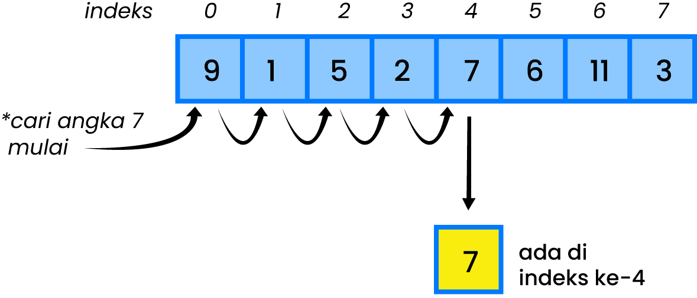

# <h1 align="center">Laporan Praktikum Modul 6 Stack</h1>
<p align="center">Muhammad Ragiel Prastyo</p>
<p align="center">2311102183</p>
<p align="center">S1IF-11-E</p>

## Dasar Teori
Searching dalam pemrograman adalah proses yang sangat fundamental Guna mencari data tertentu dalam sekumpulan data tentunya yang memiliki tipe yang sama. Pencarian diperlukan untuk mencari informasi khusus dari tabel / kumpulan data pada saat lokasi yang pasti dari informasi tersebut sebelumnya tidak diketahui. Data pada tabel biasanya disimpan dengan menggunakan tipe data Array yang dimana Array memungkinkan untuk menyimpan nilai yang bertipe sama.[1]
Adapun Metode yang digunakan dalam Searching dalam Struktur Data sebagai berikut :

### a. Sequential Search
Sequential Search adalah salah satu algoritma pencarian data yang biasa digunakan untuk data yang berpola acak atau belum terurut. Algoritma ini akan mencari data sesuai kata kunci yang diberikan mulai dari elemen awal pada array hingga elemen akhir array. Kemungkinan terbaik (best case) ketika menggunakan algoritma ini adalah jika data yang dicari terletak di indeks awal array sehingga hanya membutuhkan sedikit waktu pencarian. Sedangkan kemungkinan terburuknya (worst case) adalah jika data yang dicari ternyata terletak dibagian akhir dari array sehingga pencarian data akan memakan waktu yang lama.

Konsep Pencarian Sekuensial:
-> Membandingkan setiap elemen pada array satu per satu secara berurut.
-> Proses pencarian dimulai dari indeks pertama hingga indeks terakhir.
-> Proses pencarian akan berhenti apabila data ditemukan. Jika hingga akhir array data masih juga tidak ditemukan, maka proses pencarian tetap akan dihentikan.
-> Proses perulangan pada pencarian akan terjadi sebanyak jumlah N elemen pada array.

Berikut adalah ilustrasi dari Sequential Search:

Ilustrasi di atas menunjukkan bagaimana proses dari algoritma pencarian Sekuensial. Algoritma ini mencari angka 2 dengan mengecek setiap elemen pada array. Ketika sudah ditemukan maka proses pencarian dapat diakhiri.[2]

### b. Binary Search 
Binary search adalah sebuah algoritma pencarian yang digunakan untuk mencari elemen tertentu dalam sebuah array atau daftar yang sudah diurutkan. Algoritma ini bekerja dengan membagi daftar menjadi dua bagian, kemudian memeriksa elemen tengahnya. Jika elemen yang dicari sama dengan elemen tengah ini, pencarian selesai. Jika tidak, algoritma akan menentukan apakah elemen yang dicari lebih besar atau lebih kecil dari elemen tengah, dan kemudian hanya memeriksa salah satu bagian dari daftar yang masih mungkin mengandung elemen yang dicari. Proses ini terus berlanjut hingga elemen yang dicari ditemukan atau daftar habis diperiksa.

Cara kerja Binary Search:
1. Tentukan Rentang Pencarian Awal: Di awal pencarian, kita memiliki seluruh daftar sebagai rentang pencarian. Rentang ini didefinisikan dengan dua indeks, yaitu awal dan akhir, yang mengacu pada elemen pertama dan terakhir dalam daftar.

2. Hitung Elemen Tengah: Temukan indeks tengah di dalam rentang pencarian dengan rumus tengah = (awal + akhir) / 2.

3. Periksa Elemen Tengah: Bandingkan elemen tengah dengan elemen yang ingin Anda cari. Jika elemen tengah sama dengan elemen yang dicari, maka pencarian selesai, dan Anda telah menemukan elemennya.

4. Perkecil Rentang Pencarian: Jika elemen tengah lebih besar dari elemen yang dicari, maka Anda dapat memastikan bahwa elemen yang dicari hanya mungkin ada di sebelah kiri elemen tengah. Oleh karena itu, perkecil rentang pencarian menjadi antara awal dan tengah - 1. Jika elemen tengah lebih kecil, perkecil rentang menjadi antara tengah + 1 dan akhir.

5. Ulangi Langkah 2–4: Ulangi proses ini sampai Anda menemukan elemen yang dicari atau rentang pencarian menjadi kosong.

Berikut adalah ilustrasi dari Binary Search:

Dalam binary search, langkah pertama adalah membagi panjang data dengan 2. Panjang data awal adalah 8, kemudian kita bagi 2, yang menghasilkan 4. Sekarang, kita lihat indeks ke-4 dari data, yaitu angka 9.

Selanjutnya, kita bandingkan angka target (7) dengan hasil indeks ke-4 (9). Jika target lebih besar dari 9, maka angka [1, 3, 5, 7, 9] akan dihilangkan dari kumpulan data. Namun, jika target lebih kecil dari 9, maka angka [9, 11, 13, 15] akan dihilangkan. Proses ini terus berlanjut dengan data yang tersisa, hingga target menemukan angka yang sama dalam kumpulan data.[3]

## Guided

### 1. Buatlah sebuah project dengan menggunakan sequential search  sederhana untuk melakukan pencarian data.

```C++
// NAMA : MUHAMMAD RAGIEL PRASTYO
// NIM  : 2311102183
#include <iostream>
using namespace std;

int main()
{
    int n = 10;
    int data[n] = {9, 4, 1, 7, 5, 12, 4, 13, 4, 10};
    int cari = 10;
    bool ketemu = false;
    int i;
    // algoritma Sequential Search
    for (i = 0; i < n; i++)
    {
        if (data[i] == cari)
        {
            ketemu = true;
            break;
        }
    }
    cout << "\t Program Sequential Search Sederhana\n " << endl;
    cout << "data: {9, 4, 1, 7, 5, 12, 4, 13, 4, 10}" << endl;
    if (ketemu)
    {
        cout << "\n angka " << cari << " ditemukan pada indeks ke - " << i << endl;
    }
    else
    {
        cout << cari << " tidak dapat ditemukan pada data." << endl;
    }
    return 0;
}
```
Program ini adalah sebuah implementasi algoritma Sequential Search sederhana yang digunakan untuk mencari sebuah nilai tertentu dalam sebuah array. Dengan menggunakan loop for, program ini akan mengiterasi setiap elemen dalam array dan membandingkan setiap elemen dengan nilai yang ingin dicari. Jika nilai yang dicari ditemukan, program akan menghentikan iterasi dan menampilkan pesan yang menyatakan bahwa nilai tersebut ditemukan pada indeks tertentu. Sebaliknya, jika nilai yang dicari tidak ditemukan, program akan menampilkan pesan yang menyatakan bahwa nilai tersebut tidak dapat ditemukan dalam array.

### 2. Buatlah sebuah project untuk melakukan pencarian data dengan menggunakan Binary Search.

```C++
// NAMA : MUHAMMAD RAGIEL PRASTYO
// NIM  : 2311102183
#include <iostream>
#include <iomanip>
using namespace std;

// Deklarasi array dan variabel untuk pencarian
int arrayData[7] = {1, 8, 2, 5, 4, 9, 7};
int cari;
void selection_sort(int arr[], int n)
{
    int temp, min;
    for (int i = 0; i < n - 1; i++)
    {
        min = i;
        for (int j = i + 1; j < n; j++)
        {
            if (arr[j] < arr[min])
            {
                min = j;
            }
        }
        // Tukar elemen
        temp = arr[i];
        arr[i] = arr[min];
        arr[min] = temp;
    }
}
void binary_search(int arr[], int n, int target)
{
    int awal = 0, akhir = n - 1, tengah, b_flag = 0;
    while (b_flag == 0 && awal <= akhir)
    {
        tengah = (awal + akhir) / 2;
        if (arr[tengah] == target)
        {
            b_flag = 1;
            break;
        }
        else if (arr[tengah] < target)
        {
            awal = tengah + 1;
        }
        else
        {
            akhir = tengah - 1;
        }
    }
    if (b_flag == 1)
        cout << "\nData ditemukan pada index ke-" << tengah << endl;
    else
        cout << "\nData tidak ditemukan\n";
}
int main()
{
    cout << "\tBINARY SEARCH" << endl;
    cout << "\nData awal: ";
    // Tampilkan data awal
    for (int x = 0; x < 7; x++)
    {
        cout << setw(3) << arrayData[x];
    }
    cout << endl;
    cout << "\nMasukkan data yang ingin Anda cari: ";
    cin >> cari;
    // Urutkan data dengan selection sort
    selection_sort(arrayData, 7);
    cout << "\nData diurutkan: ";
    // Tampilkan data setelah diurutkan
    for (int x = 0; x < 7; x++)
    {
        cout << setw(3) << arrayData[x];
    }
    cout << endl;
    // Lakukan binary search
    binary_search(arrayData, 7, cari);
    return 0;
}
```
Program ini adalah implementasi algoritma pencarian binary search dalam bahasa C++. Program ini mengurutkan array dahulu dengan metode selection sort, kemudian meminta input dari pengguna untuk menentukan nilai yang ingin dicari. Program akan melakukan pencarian binary search pada array dan akan menampilkan pesan yang menyatakan bahwa nilai tersebut ditemukan atau tidak.

## Unguided

### 1. Buatlah sebuah program untuk mencari sebuah huruf pada sebuah kalimat yang sudah di input dengan menggunakan Binary Search! 

```C++
// NAMA : MUHAMMAD RAGIEL PRASTYO
// NIM  : 2311102183
#include <iostream>
#include <algorithm>
#include <vector>
using namespace std;

// Fungsi Binary Search untuk mencari elemen dalam array dan mengembalikan indeksnya
int binarySearch(const vector<char>& arr, char target) {
    int left = 0;
    int right = arr.size() - 1;

    while (left <= right) {
        int middle = left + (right - left) / 2;

        // Cek apakah target ada di tengah
        if (arr[middle] == target) {
            return middle;
        }

        // Jika target lebih besar, abaikan bagian kiri
        if (arr[middle] < target) {
            left = middle + 1;
        } else {
            // Jika target lebih kecil, abaikan bagian kanan
            right = middle - 1;
        }
    }

    // Jika target tidak ditemukan
    return -1;
}

int main() {
    string sentence;
    char target;

    cout << "\t==== BINARY SEARCH ====";

    // Input kalimat dari pengguna
    cout << "\nMasukkan sebuah kalimat: ";
    getline(cin, sentence);

    // Konversi string menjadi vector karakter dan abaikan spasi
    vector<char> data;
    for (char c : sentence) {
        if (c != ' ') {
            data.push_back(c);
        }
    }

    // Tampilkan data awal
    cout << "\nData          : ";
    for (char c : data) {
        cout << c << " ";
    }
    cout << endl;

    // Input karakter yang ingin dicari
    cout << "\nMasukkan huruf yang ingin Anda cari: ";
    cin >> target;

    // Urutkan data
    sort(data.begin(), data.end());

    // Tampilkan data yang sudah diurutkan
    cout << "\nData diurutkan: ";
    for (char c : data) {
        cout << c << " ";
    }
    cout << endl;

    // Cari karakter menggunakan Binary Search
    int index = binarySearch(data, target);

    if (index != -1) {
        cout << "\nData ditemukan pada index ke-" << index << endl;
    } else {
        cout << "\nData tidak ditemukan." << endl;
    }

    return 0;
}
```
### Output


Program di atas akan meminta pengguna untuk memasukkan sebuah kalimat dan karakter yang ingin dicari. Kemudian, program akan mengurutkan kalimat dan mencari karakter menggunakan metode pencarian biner. Jika karakter ditemukan, program akan menampilkan indeks karakter dalam kalimat. Jika tidak ditemukan, program akan menampilkan pesan bahwa karakter tidak ditemukan dalam kalimat.

### 2. Buatlah sebuah program yang dapat menghitung banyaknya huruf  vocal dalam sebuah kalimat!

```C++
// NAMA : MUHAMMAD RAGIEL PRASTYO
// NIM  : 2311102183
#include <iostream>
#include <string>
#include <cctype>
using namespace std;

// Fungsi untuk menghitung jumlah huruf vokal dalam sebuah string
int countVowels(string str) {
    int count = 0;
    for (char c : str) {
        // Mengonversi karakter menjadi huruf kecil untuk memudahkan perbandingan
        if (tolower(c) == 'a' || tolower(c) == 'e' || tolower(c) == 'i' || tolower(c) == 'o' || tolower(c) == 'u') {
            count++;
        }
    }
    return count;
}

int main() {
    string kalimat;
    cout << "\t === Menghitung Banyaknya Huruf Vocal Dalam Sebuah Kalimat ===" << endl;
    // Meminta pengguna memasukkan sebuah kalimat
    cout << "Masukkan sebuah kalimat: ";
    getline(cin, kalimat);

    // Menghitung banyaknya huruf vokal dalam kalimat
    int jumlahVokal = countVowels(kalimat);

    // Menampilkan jumlah huruf vokal dalam kalimat
    cout << "Jumlah huruf vokal dalam kalimat tersebut adalah: " << jumlahVokal << endl;

    return 0;
}
```
### Output


Program di atas akan meminta pengguna untuk memasukkan sebuah kalimat. Kemudian, program akan memanggil fungsi 'countVowels' untuk menghitung banyaknya huruf vokal dalam kalimat. Fungsi 'countVowels' mengiterasi setiap karakter dalam kalimat dan mengecek apakah karakter tersebut adalah huruf vokal atau bukan. Jika karakter tersebut adalah huruf vokal, fungsi akan menambahkan 1 ke variabel 'count'. Setelah selesai mengiterasi semua karakter, fungsi akan mengembalikan nilai 'count' sebagai jumlah huruf vokal.
Dalam fungsi 'main', setelah meminta pengguna untuk memasukkan kalimat, program akan memanggil fungsi 'countVowels' dan menyimpan hasilnya ke variabel 'jumlahVokal'. Kemudian, program akan menampilkan jumlah huruf vokal yang telah dicari.

### 3. Diketahui data = 9, 4, 1, 4, 7, 10, 5, 4, 12, 4. Hitunglah berapa banyak  angka 4 dengan menggunakan algoritma Sequential Search! 

```C++
// NAMA : MUHAMMAD RAGIEL PRASTYO
// NIM  : 2311102183
#include <iostream>
using namespace std;

// Fungsi untuk melakukan pencarian sekuensial dan menghitung kemunculan target
int sequentialSearch(int data[], int size, int target) {
    int count = 0;
    for (int i = 0; i < size; i++) {
        if (data[i] == target) {
            count++;
        }
    }
    return count;
}

int main() {
    // Inisialisasi array dengan data yang diberikan
    int data[] = {9, 4, 1, 4, 7, 10, 5, 4, 12, 4};
    int size = sizeof(data) / sizeof(data[0]);
    int target = 4;

    // Menghitung banyaknya angka 4 dalam data menggunakan pencarian sekuensial
    int jumlahKemunculan = sequentialSearch(data, size, target);

    // Menampilkan hasil pencarian
    cout << "Banyaknya angka " << target << " dalam data tersebut adalah: " << jumlahKemunculan << endl;

    return 0;
}
```
### Output


Program di atas akan menginisialisasi data, ukuran data, dan target yang akan dicari. Kemudian, program akan memanggil fungsi 'sequentialSearch' untuk mencari banyaknya target dalam data. Fungsi 'sequentialSearch' mengiterasi setiap elemen dalam data dan mengecek apakah elemen tersebut sama dengan target atau bukan. Jika elemen tersebut sama dengan target, fungsi akan menambahkan 1 ke variabel 'count'. Setelah selesai mengiterasi semua elemen, fungsi akan mengembalikan nilai 'count' sebagai jumlah kemunculan target dalam data.
Dalam fungsi 'main', setelah menginisialisasi data, ukuran data, dan target, program akan memanggil fungsi 'sequentialSearch' dan menyimpan hasilnya ke variabel 'jumlahKemunculan'. Kemudian, program akan menampilkan jumlah kemunculan target yang telah dicari.

## Kesimpulan
Dalam pemrograman, searching (pencarian) adalah proses mencari data tertentu dalam suatu struktur data seperti array atau daftar. Dua metode pencarian yang umum digunakan adalah Sequential Search dan Binary Search.
Sequential Search adalah metode pencarian yang membandingkan setiap elemen satu per satu dari awal hingga akhir array, berhenti ketika data yang dicari ditemukan atau saat seluruh array telah diperiksa. Cocok untuk data yang tidak terurut namun memiliki kelemahan dalam efisiensi waktu, terutama pada data besar.
Sementara itu, Binary Search adalah teknik pencarian yang membagi array menjadi dua bagian, memeriksa elemen tengah, dan menentukan apakah data yang dicari berada di bagian kiri atau kanan. Proses ini terus berlanjut dengan memperkecil rentang pencarian hingga data ditemukan atau rentang menjadi kosong. Lebih efisien untuk data yang sudah terurut, namun memerlukan persyaratan array terurut sebelumnya.

## Referensi
[1] Daisma B. (2019, Dec. 21) Metode Searching dalam Struktur Data dan Implementasi Pemrogramannya [online]. Available : https://daismabali.medium.com/metode-searching-dalam-struktur-data-dan-implementasi-pemrogramannya-d97582084866

[2] M Wafa. (2021, Dec. 06) Sequential Search-Algoritma Pencarian [online]. Available : https://mikirinkode.com/sequential-search/

[3] Engineer P. (2023, Nov. 10) Mengenal Algoritma Binary Search [online]. Available : https://engineerpalsu.medium.com/mengenal-algoritma-binary-search-40a9047dab62