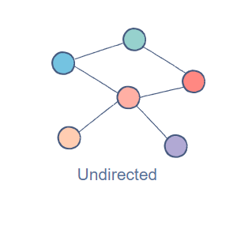
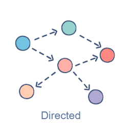
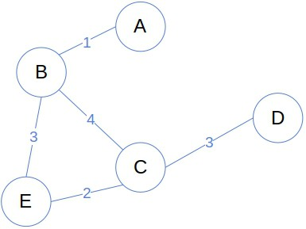
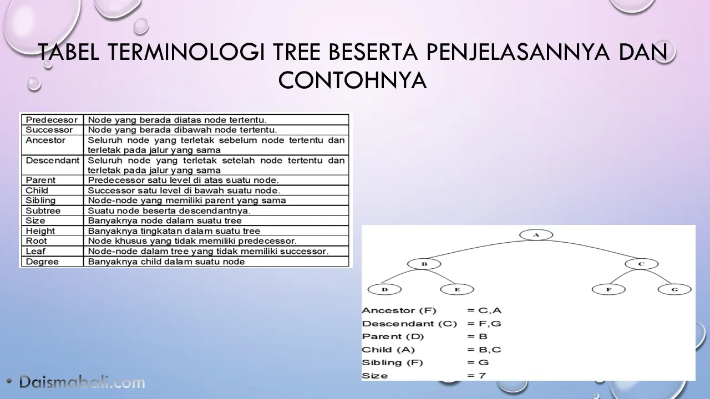
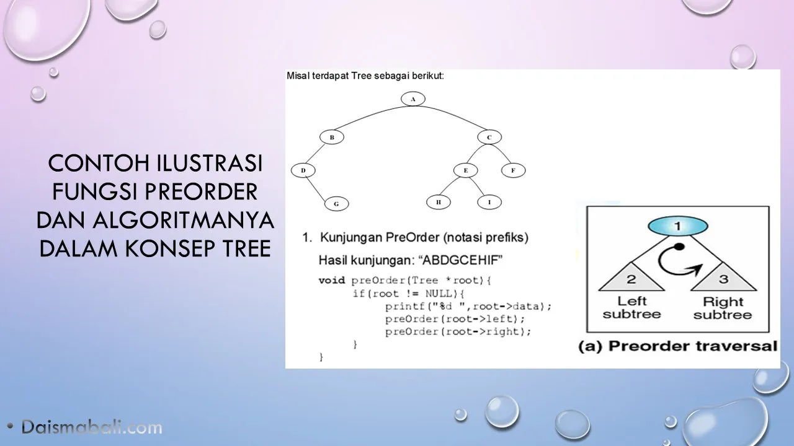
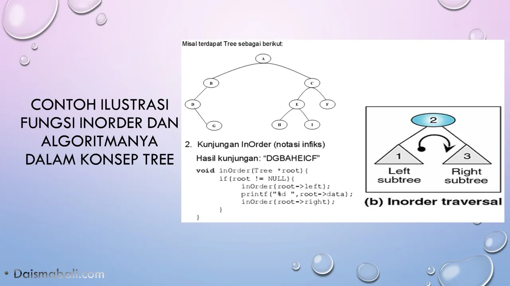
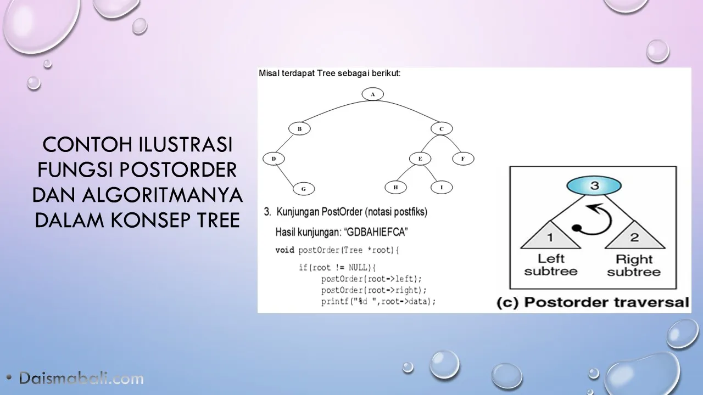

# <h1 align="center">Laporan Praktikum Modul 9 Graph dan Tree</h1>
<p align="center">Muhammad Ragiel Prastyo</p>
<p align="center">2311102183</p>
<p align="center">S1IF-11-E</p>

## Dasar Teori
### Graph
Graph adalah jenis struktur data umum yang susunan datanya tidak berdekatan satu sama lain (non-linier). Graph terdiri dari kumpulan simpul berhingga untuk menyimpan data dan antara dua buah simpul terdapat hubungan saling keterkaitan. Simpul pada graph disebut dengan verteks (V), sedangkan sisi yang menghubungkan antar verteks disebut edge (E). Pasangan (x,y) disebut sebagai edge, yang menyatakan bahwa simpul x terhubung ke simpul y.

Sebagai contoh, terdapat graph seperti berikut:


Graph di atas terdiri atas 4 buah verteks dan 4 pasang sisi atau edge. Dengan verteks disimbolkan sebagai V, edge dilambangkan E, dan graph disimbolkan G.

- Jenis-Jenis Graph

1. Undirected Graph
Pada undirected graph, simpul-simpulnya terhubung dengan edge yang sifatnya dua arah. Misalnya kita punya simpul 1 dan 2 yang saling terhubung, kita bisa menjelajah dari simpul 1 ke simpul 2, begitu juga sebaliknya.


2. Directed Graph
Kebalikan dari undirected graph, pada graph jenis ini simpul-simpulnya terhubung oleh edge yang hanya bisa melakukan jelajah satu arah pada simpul yang ditunjuk.


3. Weighted Graph
Weighted graph adalah jenis graph yang cabangnya diberi label bobot berupa bilangan numerik. Pemberian label bobot pada edge biasanya digunakan untuk memudahkan algoritma dalam menyelesaikan masalah.


4. Unweighted Graph
Berbeda dengan jenis sebelumnya, unweighted graph tidak memiliki properti bobot pada koneksinya. Graph ini hanya mempertimbangkan apakah dua node saling terhubung atau tidak.

- Karakteristik Graph

1. Jarak maksimum dari sebuah simpul ke semua simpul lainnya dianggap sebagai eksentrisitas dari simpul tersebut.
2. Titik yang memiliki eksentrisitas minimum dianggap sebagai titik pusat dari graph.
3. Nilai eksentrisitas minimum dari semua simpul dianggap sebagai jari-jari dari graph terhubung.[1]

### Tree atau Pohon
Dalam Struktur Data Konsep Tree mirip seperti pohon yaitu kumpulan node yang saling terhubung satu sama lain dalam suatu kesatuan yang membentuk layaknya struktur sebuah pohon. Struktur Tree adalah suatu cara merepresentasikan suatu struktur hirarki ( one — to many ) secara grafis yang mirip sebuah pohon, walaupun pohon tersebut hanya tampak sebagai kumpulan — node — node dari atas ke bawah. Konsep Tree Di seuah struktur data yang tidak linier yang menggambarkan hubungan yang hirarkis ( one to many ) dan tidak linier antara elemen — elemennya.

Dalam Konsep Tree di sebuah Node ada namanya Node Root. Node Root dalam sebuah tree yang dimaksud adalah suatu node yang memiliki hirarki tertinggi dan dapat juga memiliki node — node anak atau yang disebut child node. jadi semua node yang dapat ditelurusan dari node root tersebut. Node Root dicirikan adalah suatu node khusus yang tercipta pertama kalinya. Sedangkan Node — Node lain dibawah node root saling terhubung satu sama lain disebut sebagai Subtree

Berikut Istilah dan Pengertian dari istilah terminologi Tree dalam struktur data dalam gambar berikut :


Adapun Proses dari Implementasi Program terkait Konsep Tree seperti berikut :
1. Data yang pertama kali masuk akan menjadi Node Root.
2. Data yang lebih kecil dari node root akan masuk dan menempati node kiri dari node Root.
3. Jika ada Data yang lebih besar dari Node Root maka akan masuk dan menempati node sebelah kanan dari Node Root.

- Operasi-Operasi pada Tree

1. Create() : Fungsi ini merupakan fungsi untuk membentuk sebuah tree baru yang kosong biasanya berisi inisialisasi variable tree yang bernilai Null.

2. Clear() : Fungsi ini merupakan fungsi untuk menghapus semua elemen tree dalam implementasinya cukup tambahkan syntax pohon = NULL; dalam fungsi Clear().

3. Empty() : Fungsi ini mengetahui apakah tree kosong atau tidak di sebuah pemrograman.

4. Insert : Fungsi ini merupakan fungsi yang menambah node ke dalam tree secara rekursif.

5. Traverse : Fungsi ini merupakan operasi kunjungan ( mengunjungi data ) terhadap node — node dalam tree yang dimana masing — masing node akan dikunjungi sekali. Adapun Jenis Traverse dalam Konsep Tree seperti berikut :
    - PreOrder : Proses Traverse yang melakukan tahapan cetak node yang dikunjungi, kunjungi left node , kunjungi right node.
    Berikut Ilustrasi PreOrder dan Algoritma dalam Fungsi Traverse :
    

    - InOrder : Proses Traverse yang melakukan tahapan kunjungi left node, cetak node yang dikunjungi, kunjungi right node.
    Berikut Ilustrasi InOrder dan Algoritma dalam Fungsi Traverse :
    

    - PostOrder : Proses Traverse yang melakukan tahapan kunjungi left node, kunjungi right node, cetak node yang dikunjungi.
    Berikut Ilustrasi PostOrder dan Algoritma dalam Fungsi Traverse :
     [2]

## Guided

### 1. Program Graph

```C++
// NAMA : MUHAMMAD RAGIEL PRASTYO
// NIM  : 2311102183
#include <iostream>
#include <iomanip>
using namespace std;

//Deklarasi array simpul yang berisi nama-nama kota
string simpul[7] = {
    "Ciamis", "Bandung", "Bekasi", "Tasikmalaya", "Cianjur", "Purwokerto", "Yogyakarta"
};

//Deklarasi array busur 2 dimensi yang berisi bobot atau nilai antar kota
int busur[7][7]= {
    {0, 7, 8, 0, 0, 0, 0},
    {0, 0, 5, 0, 0, 15, 0},
    {0, 6, 0, 0, 5, 0, 0},
    {0, 5, 0, 0, 2, 4, 0},
    {23, 0, 0, 10, 0, 0, 8},
    {0, 0, 0, 0, 7, 0, 3},
    {0, 0, 0, 0, 9, 4, 0}
};

//Prosedur TampilGraph untuk menampilkan kota dengan bobot jarak ke kota lainnya
void TampilGraph(){
    for(int baris = 0; baris < 7; baris++){
        cout << " " << setiosflags(ios :: left) << setw(15) << simpul[baris] << " : ";
        for(int kolom = 0; kolom < 7; kolom++){
            if(busur[baris][kolom] != 0){
                cout << " " << simpul[kolom] << "(" << busur[baris][kolom] << ")";
            }
        } cout << endl;
    }
}

int main(){
    //Pemanggilan prosedur TampilGraph
    TampilGraph();

    return 0;
}
```

### 2. Program Tree

```C++
// NAMA : MUHAMMAD RAGIEL PRASTYO
// NIM  : 2311102183
#include <iostream>
#include <iomanip>
using namespace std;

//Deklarasi struct pohon yang nodenya berisi variabel data
struct Pohon{
    char data;
    Pohon *left, *right, *parent; //deklarasi node left, right, dan parent 
};
Pohon *root, *baru; //Deklarasi node root dan node baru

//Prosudr inisialisasi
void init(){
    root = NULL; //Menyatakan node root adalah NULL
}

//Fungsi isEmpty untuk memeriksa apakah tree kosong atau tidak
bool isEmpty(){
    return root == NULL;
}

//Prosedur buatNode untuk membuat node baru
void buatNode(char data){
    if (isEmpty())
    {
        root = new Pohon();
        root->data = data;
        root->left = NULL;
        root->right = NULL;
        root->parent = NULL;
        cout << "\n Node " << data << " berhasil dibuat sebagai root."
             << endl;
    }
    else
    {
        cout << "\n Tree sudah ada!" << endl;
    }
}

//Fungsi untuk membuat node child kiri
Pohon *insertLeft(char data, Pohon *node)
{
    if (isEmpty())
    {
        cout << "\n Buat tree terlebih dahulu!" << endl;
        return NULL;
    }
    else
    {
        if (node->left != NULL)
        {
            cout << "\n Node " << node->data << " sudah ada child kiri !" << endl;
                return NULL;
        }
        else
        {
            Pohon *baru = new Pohon();
            baru->data = data;
            baru->left = NULL;
            baru->right = NULL;
            baru->parent = node;
            node->left = baru;
            cout << "\n Node " << data << " berhasil ditambahkan ke child kiri " << baru->parent->data << endl;
                return baru;
        }
    }
}

//Fungsi untuk membuat node child kanan
Pohon *insertRight(char data, Pohon *node)
{
    if (isEmpty())
    {
        cout << "\n Buat tree terlebih dahulu!" << endl;
        return NULL;
    }
    else
    {
        if (node->right != NULL)
        {
            cout << "\n Node " << node->data << " sudah ada child kanan !" << endl;
                return NULL;
        }
        else
        {
            Pohon *baru = new Pohon();
            baru->data = data;
            baru->left = NULL;
            baru->right = NULL;
            baru->parent = node;
            node->right = baru;
            cout << "\n Node " << data << " berhasil ditambahkan ke child kanan " << baru->parent->data << endl;
                return baru;
        }
    }
}

//Prosedur untuk mengupdate nilai suatu node
void update(char data, Pohon *node)
{
    if (isEmpty())
    {
        cout << "\n Buat tree terlebih dahulu!" << endl;
    }
    else
    {
        if (!node)
        {
            cout << "\n Node yang ingin diganti tidak ada!!" << endl;
        }
        else
        {
            char temp = node->data;
            node->data = data;
            cout << "\n Node " << temp << " berhasil diubah menjadi "
                 << data << endl;
        }
    }
}

//Prosedur untuk menunjuk suatu node
void retrieve(Pohon *node)
{
    if (isEmpty())
    {
        cout << "\n Buat tree terlebih dahulu!" << endl;
    }
    else
    {
        if (!node)
        {
            cout << "\n Node yang ditunjuk tidak ada!" << endl;
        }
        else
        {
            cout << "\n Data node : " << node->data << endl;
        }
    }
}

//Prosedur untuk mencari suatu node kemudian menampilkan root, parent, sibling, dan child node tersebut
void find(Pohon *node)
{
    if (isEmpty())
    {
        cout << "\n Buat tree terlebih dahulu!" << endl;
    }
    else
    {
        if (!node)
        {
            cout << "\n Node yang ditunjuk tidak ada!" << endl;
        }
        else
        {
            cout << "\n Data Node : " << node->data << endl;
            cout << " Root : " << root->data << endl;
            if (!node->parent)
                cout << " Parent : (tidak punya parent)" << endl;
            else
                cout << " Parent : " << node->parent->data << endl;
            if (node->parent != NULL && node->parent->left != node &&
                node->parent->right == node)
                cout << " Sibling : " << node->parent->left->data << endl;
            else if (node->parent != NULL && node->parent->right != node && node->parent->left == node)
                cout << " Sibling : " << node->parent->right->data << endl;
            else
                cout << " Sibling : (tidak punya sibling)" << endl;
            if (!node->left)
                cout << " Child Kiri : (tidak punya Child kiri)" << endl;
            else
                cout << " Child Kiri : " << node->left->data << endl;
            if (!node->right)
                cout << " Child Kanan : (tidak punya Child kanan)" << endl;
            else
                cout << " Child Kanan : " << node->right->data << endl;
        }
    }
}

// Penelusuran (Traversal)
//Prosedur untuk menampilkan traversal secara pre order
void preOrder(Pohon *node = root)
{
    if (isEmpty())
    {
        cout << "\n Buat tree terlebih dahulu!" << endl;
    }
    else
    {
        if (node != NULL)
        {
            cout << " " << node->data << ", ";
            preOrder(node->left);
            preOrder(node->right);
        }
    }
}

//Prosedur untuk menampilkan traversal secara in order
void inOrder(Pohon *node = root)
{
    if (isEmpty())
    {
        cout << "\n Buat tree terlebih dahulu!" << endl;
    }
    else
    {
        if (node != NULL)
        {
            inOrder(node->left);
            cout << " " << node->data << ", ";
            inOrder(node->right);
        }
    }
}

//Prosedur untuk menampilkan traversal secara post order
void postOrder(Pohon *node = root)
{
    if (isEmpty())
    {
        cout << "\n Buat tree terlebih dahulu!" << endl;
    }
    else
    {
        if (node != NULL)
        {
            postOrder(node->left);
            postOrder(node->right);
            cout << " " << node->data << ", ";
        }
    }
}

//Prosedur untuk menhapus sebuah node didalam tree
void deleteTree(Pohon *node)
{
    if (isEmpty())
    {
        cout << "\n Buat tree terlebih dahulu!" << endl;
    }
    else
    {
        if (node != NULL)
        {
            if (node != root)
            {
                node->parent->left = NULL;
                node->parent->right = NULL;
            }
            deleteTree(node->left);
            deleteTree(node->right);
            if (node == root)
            {
                delete root;
                root = NULL;
            }
            else
            {
                delete node;
            }
        }
    }
}

//Prosedur untuk menghapus sub tree
void deleteSub(Pohon *node)
{
    if (isEmpty())
    {
        cout << "\n Buat tree terlebih dahulu!" << endl;
    }
    else
    {
        deleteTree(node->left);
        deleteTree(node->right);
        cout << "\n Node subtree " << node->data << " berhasil dihapus." << endl;
    }
}

//Prosedur untuk menghapus seluruh tree
void clear()
{
    if (isEmpty())
    {
        cout << "\n Buat tree terlebih dahulu!!" << endl;
    }
    else
    {
        deleteTree(root);
        cout << "\n Pohon berhasil dihapus." << endl;
    }
}

//Fungsi untuk memeriksa jumlah node (size) didalam tree
int size(Pohon *node = root)
{
    if (isEmpty())
    {
        cout << "\n Buat tree terlebih dahulu!!" << endl;
        return 0;
    }
    else
    {
        if (!node)
        {
            return 0;
        }
        else
        {
            return 1 + size(node->left) + size(node->right);
        }
    }
}

//Fungsi untuk memeriksa level atau aras (height) tree
int height(Pohon *node = root)
{
    if (isEmpty())
    {
        cout << "\n Buat tree terlebih dahulu!" << endl;
        return 0;
    }
    else
    {
        if (!node)
        {
            return 0;
        }
        else
        {
            int heightKiri = height(node->left);
            int heightKanan = height(node->right);
            if (heightKiri >= heightKanan)
            {
                return heightKiri + 1;
            }
            else
            {
                return heightKanan + 1;
            }
        }
    }
}

//Prosedur untuk memeriksa karakteristik tree
void characteristic()
{
    cout << "\n Size Tree : " << size() << endl;
    cout << " Height Tree : " << height() << endl;
    cout << " Average Node of Tree : " << size() / height() << endl;
}

int main()
{
    buatNode('A'); //buat node A sebagai root
    Pohon *nodeB, *nodeC, *nodeD, *nodeE, *nodeF, *nodeG, *nodeH, *nodeI, *nodeJ; //deklarasi node B-J
    
    nodeB = insertLeft('B', root), //tambah node B sebagai child kiri node A
    nodeC = insertRight('C', root), //tambah node C sebagai child kanan node A
    nodeD = insertLeft('D', nodeB), //tambah node D sebagai child kiri node B
    nodeE = insertRight('E', nodeB), //tambah node e sebagai child kanan node B
    nodeF = insertLeft('F', nodeC), //tambah node F sebagai child kiri node C
    nodeG = insertLeft('G', nodeE), //tambah node G sebagai child kiri node E
    nodeH = insertRight('H', nodeE), //tambah node H sebagai child kanan node E
    nodeI = insertLeft('I', nodeG), //tambah node I sebagai child kiri node G
    nodeJ = insertRight('J', nodeG); //tambah node J sebagai child kanan node G

    update('Z', nodeC); //update (ubah) nama node C menjadi Z
    update('C', nodeC); //update (ubah) kembali nama node C menjadi C

    retrieve(nodeC); //Tunjuk node C

    find(nodeC); //Mencari node C dan menampilkan root, parent, sibling, dan child node tersebut

    characteristic(); //Menampilkan karakteristik tree

    //Menampilkan traversal tree secara pre order
    cout << "PreOrder : " << endl;
    preOrder(root);
    cout << "\n" << endl;

    //menampilkan traversal tree secara in order
    cout << "InOrder : " << endl;
    inOrder(root);
    cout << "\n" << endl;

    //menampilkan traversal tree secara post order
    cout << "PostOrder : " << endl;
    postOrder(root);
    cout << "\n" << endl;

    return 0;
}
```

## Unguided
*Cantumkan NIM pada salah satu variabel di dalam program. Contoh : int nama_22102003; 

### 1. Buatlah program graph dengan menggunakan inputan user untuk menghitung jarak dari sebuah kota ke kota lainnya.

```C++

```